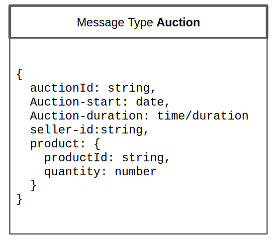
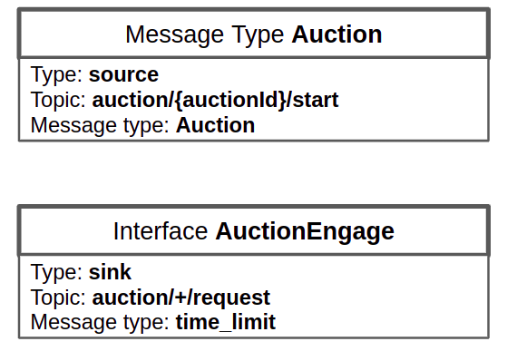
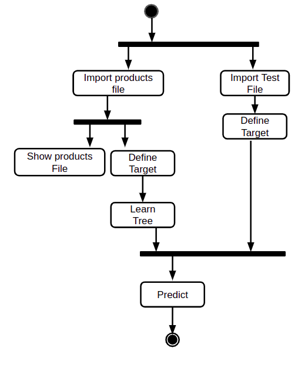

# Coreografia e Orquestração no Brechó Online

Retomando o laboratório anterior que tem o desafio de trabalhar o tema de serviços de aprendizagem de máquina dentro do contexto do projeto Brechó Online. Mais especificamente será feito um recorte na recomendação de vendedores/produtos para clientes em busca de um produto.

Retomando o cenário: no Brechó Online há uma grande quantidade (sempre crescente) de vendedores oferecendo produtos e de clientes buscando produtos. Você está projetando um serviço de recomendação que deve ranquear ofertas de produtos/vendedores de acordo com um produto buscado por um cliente.

O seu serviço de aprendizagem de máquina vai funcionar em duas partes: módulo de aprendizagem constante e módulo de ranqueamento. O módulo de aprendizagem constante, recebe constantemente dados do sistema (a sua escolha) e aprende padrões sobre preferências de clientes para futura recomendação. Como os produtos, preferências e tendências mudam ao longo do tempo, este módulo está constantemente aprendendo, a fim de atualizar seu conhecimento. O módulo de ranqueamento faz recomendações para clientes, ranqueando ofertas de produtos de acordo com alguma busca que esse cliente esteja executando. Ele deve levar em conta o perfil do cliente e do vendedor para realizar o ranqueamento.

## Tarefa 1 - Detalhando a Negociação das Ofertas

Considere uma extensão desse ranqueamento funciona na forma de uma negociação automatizada. De um lado há vários fornecedores e, do outro, vários clientes. Cada vez que um cliente posta uma solicitação, isso vai para um espaço de negociação, acessível por qualquer fornecedor. Os fornecedores postam suas ofertas, que serão recebidas pelos clientes. Nesse espaço de negociação, os clientes podem fazer uma contra proposta para um fornecedor. Caso o fornecedor concorde com a contraproposta, ele comunica ao cliente.

a) Considere que haverá um DTO (Data Transfer Object) que incorpora toda a negociação (itens que o cliente quer comprar e valores oferecidos e negociados). Como você representaria esse DTO?

b) Construa um diagrama dos componentes envolvidos na negociação e descreva com as suas palavras como eles interagem (escreva na forma de tópicos em que item é descrito brevemente).
Para esta tarefa utilize os [Diagramas de Referência](https://docs.google.com/presentation/d/1g2mds_SA_w0WNuJmoMg1UZtNbPQMnEz54XWL_DoRDtg/edit?usp=sharing).

## Tarefa 2 - Recomendação de Preço

Considerando o que existe um conjunto de dados históricos sobre produtos, valores, frete e dias de entrega, ranqueados por preferência, escreva um sistema que ranqueie produtos de acordo com ofertas feitas pelos fornecedores.

a) Elabore um workflow em Orange para recomendação. Utilize o arquivo [products-negotiated.csv](products-negotiated.csv) para o treinamento e o arquivo [products-negotiated-test.csv]( products-negotiated-test.csv) para teste.

b) Transforme esse workflow em uma representação UML.

 
